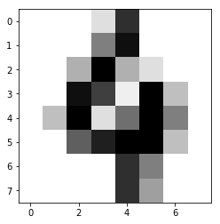

# Machine Learning with scikit-learn

## Hand-written digit recognition
Load hand-written digit images


```python
import numpy as np
import matplotlib.pyplot as plt

from sklearn import datasets, svm, metrics
```


```python
digits = datasets.load_digits()
print(digits.images.shape)
digits.images[100]     
```

    (1797, 8, 8)
    


    array([[  0.,   0.,   0.,   2.,  13.,   0.,   0.,   0.],
           [  0.,   0.,   0.,   8.,  15.,   0.,   0.,   0.],
           [  0.,   0.,   5.,  16.,   5.,   2.,   0.,   0.],
           [  0.,   0.,  15.,  12.,   1.,  16.,   4.,   0.],
           [  0.,   4.,  16.,   2.,   9.,  16.,   8.,   0.],
           [  0.,   0.,  10.,  14.,  16.,  16.,   4.,   0.],
           [  0.,   0.,   0.,   0.,  13.,   8.,   0.,   0.],
           [  0.,   0.,   0.,   0.,  13.,   6.,   0.,   0.]])


1797개의 이미지 샘플이 들어 있다. Digit 이미지는 8x8 matrix로 표현되고 값들은 gray level이다.

100번째 이미지를 보면,


```python
plt.imshow(digits.images[100], cmap=plt.cm.gray_r)
plt.show()
print('labeled:', digits.target[100])
```





    labeled: 4
    

##  Prepare data


```python
n_samples = len(digits.images)
data = digits.images.reshape((n_samples, -1))  # flatten images
print('(samples, features):', data.shape)
```

    (samples, features): (1797, 64)
    


```python
n_train = round(n_samples * 0.8)
train_data, test_data = data[:n_train], data[n_train:]
train_target, test_target = digits.target[:n_train], digits.target[n_train:]
print('train set:', train_data.shape)
print('test set:', test_data.shape)
```

    train set: (1438, 64)
    test set: (359, 64)
    

## Training


```python
# Create a classifier: a support vector classifier
classifier = svm.SVC(gamma=0.001)

# train the classifier
classifier.fit(train_data, train_target)
```


    SVC(C=1.0, cache_size=200, class_weight=None, coef0=0.0,
      decision_function_shape='ovr', degree=3, gamma=0.001, kernel='rbf',
      max_iter=-1, probability=False, random_state=None, shrinking=True,
      tol=0.001, verbose=False)


## Prediction


```python
# Now predict the value of the digit on the second half:
expected = test_target
predicted = classifier.predict(test_data)
```


```python
import pandas as pd

df = pd.DataFrame({'expected': expected, 'predicted': predicted})
# df[df['expected'] != df['predicted']]
df[df.expected != df.predicted]   # show wrong answers
```


<div>
<style>
    .dataframe thead tr:only-child th {
        text-align: right;
    }

    .dataframe thead th {
        text-align: left;
    }

    .dataframe tbody tr th {
        vertical-align: top;
    }
</style>
<table border="1" class="dataframe">
  <thead>
    <tr style="text-align: right;">
      <th></th>
      <th>expected</th>
      <th>predicted</th>
    </tr>
  </thead>
  <tbody>
    <tr>
      <th>30</th>
      <td>8</td>
      <td>9</td>
    </tr>
    <tr>
      <th>115</th>
      <td>8</td>
      <td>1</td>
    </tr>
    <tr>
      <th>135</th>
      <td>0</td>
      <td>4</td>
    </tr>
    <tr>
      <th>164</th>
      <td>3</td>
      <td>8</td>
    </tr>
    <tr>
      <th>167</th>
      <td>3</td>
      <td>7</td>
    </tr>
    <tr>
      <th>173</th>
      <td>4</td>
      <td>9</td>
    </tr>
    <tr>
      <th>190</th>
      <td>4</td>
      <td>8</td>
    </tr>
    <tr>
      <th>220</th>
      <td>9</td>
      <td>3</td>
    </tr>
    <tr>
      <th>222</th>
      <td>4</td>
      <td>8</td>
    </tr>
    <tr>
      <th>224</th>
      <td>9</td>
      <td>5</td>
    </tr>
    <tr>
      <th>252</th>
      <td>3</td>
      <td>8</td>
    </tr>
    <tr>
      <th>288</th>
      <td>3</td>
      <td>8</td>
    </tr>
    <tr>
      <th>289</th>
      <td>3</td>
      <td>8</td>
    </tr>
    <tr>
      <th>291</th>
      <td>3</td>
      <td>5</td>
    </tr>
    <tr>
      <th>327</th>
      <td>3</td>
      <td>5</td>
    </tr>
  </tbody>
</table>
</div>


```python
print("Classification report for classifier:\n%s\n" % (classifier))
print(metrics.classification_report(expected, predicted))
print("Confusion matrix:\n%s" % metrics.confusion_matrix(expected, predicted))
```

    Classification report for classifier:
    SVC(C=1.0, cache_size=200, class_weight=None, coef0=0.0,
      decision_function_shape='ovr', degree=3, gamma=0.001, kernel='rbf',
      max_iter=-1, probability=False, random_state=None, shrinking=True,
      tol=0.001, verbose=False)
    
                 precision    recall  f1-score   support
    
              0       1.00      0.97      0.99        35
              1       0.97      1.00      0.99        36
              2       1.00      1.00      1.00        34
              3       0.97      0.81      0.88        37
              4       0.97      0.92      0.94        37
              5       0.93      1.00      0.96        37
              6       1.00      1.00      1.00        37
              7       0.97      1.00      0.99        36
              8       0.84      0.94      0.89        33
              9       0.95      0.95      0.95        37
    
    avg / total       0.96      0.96      0.96       359
    
    Confusion matrix:
    [[34  0  0  0  1  0  0  0  0  0]
     [ 0 36  0  0  0  0  0  0  0  0]
     [ 0  0 34  0  0  0  0  0  0  0]
     [ 0  0  0 30  0  2  0  1  4  0]
     [ 0  0  0  0 34  0  0  0  2  1]
     [ 0  0  0  0  0 37  0  0  0  0]
     [ 0  0  0  0  0  0 37  0  0  0]
     [ 0  0  0  0  0  0  0 36  0  0]
     [ 0  1  0  0  0  0  0  0 31  1]
     [ 0  0  0  1  0  1  0  0  0 35]]
    
