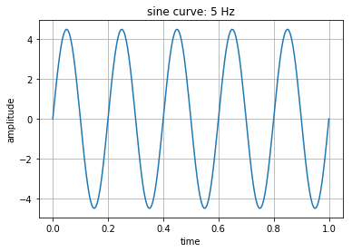
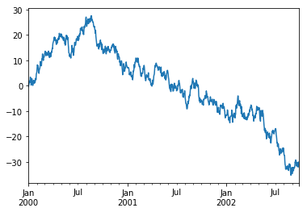
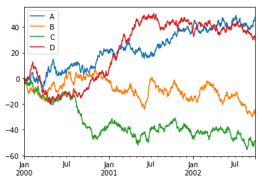
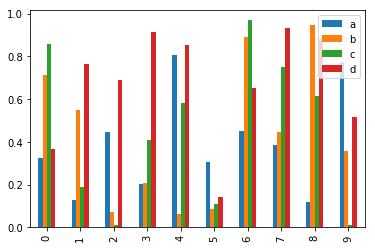

# Visualization with Mathplotlib


```python
import numpy as np
import pandas as pd
import matplotlib.pyplot as plt
```

Using numpy array


```python
# sine curve plotting
a = 4.5
f = 5
t = np.linspace(0, 1, 200)
y = a * np.sin(2 * np.pi * f * t)

plt.plot(t, y)
plt.grid()
plt.title('sine curve: %d Hz' % f)
plt.xlabel('time')
plt.ylabel('amplitude')
plt.show()        # draw the figure
```





Using Series


```python
# 1000 samples from "standard normal dist." for 1,000 days
ts = pd.Series(np.random.randn(1000),  
               index=pd.date_range('1/1/2000', periods=1000))
print(ts.head())
print(ts.tail())
```

    2000-01-01   -0.341262
    2000-01-02    0.439993
    2000-01-03    0.721942
    2000-01-04    0.749945
    2000-01-05    0.323920
    Freq: D, dtype: float64
    2002-09-22   -0.346858
    2002-09-23    0.842575
    2002-09-24    1.117296
    2002-09-25   -0.498234
    2002-09-26   -1.394433
    Freq: D, dtype: float64
    


```python
tc = ts.cumsum()     # cummulative sum
tc.plot()
```


    <matplotlib.axes._subplots.AxesSubplot at 0x2401c7f4ba8>





Using DataFrame


```python
df = pd.DataFrame(np.random.randn(1000, 4), index=ts.index, columns=list('ABCD'))
df = df.cumsum()
print(df.head())
df.plot()
```

                       A         B         C         D
    2000-01-01 -0.819724  0.037414 -1.594212  0.011391
    2000-01-02 -2.466096  0.455497 -1.855120 -1.797907
    2000-01-03 -3.285080 -0.554364 -2.287279 -2.854246
    2000-01-04 -4.486317 -0.547233 -1.807320 -3.509680
    2000-01-05 -4.022742 -0.403367 -1.430638 -2.179496
    


    <matplotlib.axes._subplots.AxesSubplot at 0x2401cb38668>





```python
df2 = pd.DataFrame(np.random.rand(10, 4), columns=['a', 'b', 'c', 'd'])
df2.plot.bar()
```


    <matplotlib.axes._subplots.AxesSubplot at 0x2401ddfb358>




